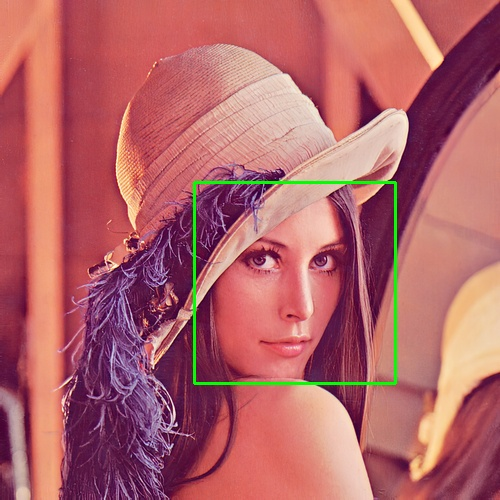
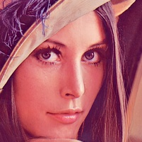
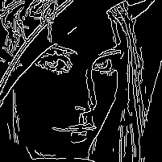
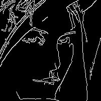
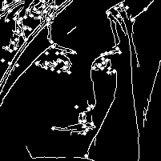
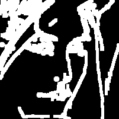
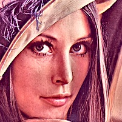
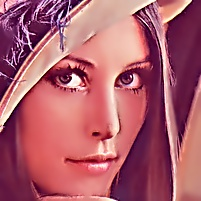

## Описание
Проект реализует последовательную обработку лица на изображении:
1. Поиск лица и вырезка с отступом 10%.
2. Детекция границ методом Кэнни и удаление мелких контуров.
3. Добавление угловых точек.
4. Морфологическая операция dilation (5×5).
5. Создание маски M (нормализация 0–1).
6. Фильтрация лица (сглаживание F1 и улучшение F2).
7. Комбинация по формуле: Result = M * F2 + (1 - M) * F1
8. Бесшовная вставка лица обратно в исходное изображение.
   
## Структура проекта
```plaintext
face_processing_lab/
│
├── main.py                 # основной скрипт обработки (уже готов)
├── requirements.txt        # зависимости
├── README.md               # описание проекта и инструкции
├── results/                # результаты работы (изображения)
│   ├── 00_original.jpg
│   ├── 01_face_bbox.jpg
│   ├── ...
│   └── 11_seamless_back.jpg
└── original.png                # исходное изображение
```
## Установка
```bash
git clone https://github.com/<твой_логин>/face_processing_lab.git
cd face_processing_lab
pip install -r requirements.txt
```

Результаты сохраняются в папку results/.

## Логика данных
| Переменная           | Описание                            |
| -------------------- | ----------------------------------- |
| `img`                | исходное изображение                |
| `face_roi`           | вырезанное лицо                     |
| `edges`              | границы (Canny)                     |
| `edges_clean`        | очищенные контуры                   |
| `edges_plus_corners` | контуры + углы                      |
| `dilated`            | после dilation                      |
| `M`                  | маска 0–1                           |
| `F1`, `F2`           | сглаженное и улучшенное изображения |
| `result_face`        | итоговое лицо                       |
| `seamless`           | вставленное обратно изображение     |


## Описание функций
| Этап | Изображение |
|------|--------------|
| Исходное |  |
| Обнаружение лица |  |
| Вырезанное лицо |  |
| Границы |  |
| Очистка контуров |  |
| Углы |  |
| Морфология |  |
| Маска |  |
| Сглаживание |  |
| Улучшение |  |
| Комбинация |  |
| Итог |  |

### expand_bbox(x, y, w, h, scale: float, W: int, H: int)
Расширяет найденную область лица на заданный процент (scale), не выходя за границы изображения.
- x, y, w, h — координаты и размеры исходного прямоугольника лица.
- scale — доля от ширины/высоты (например, 0.10 = 10%).
- W, H — полные размеры исходного изображения.

Возвращает:
(x2, y2, w2, h2) — координаты и размеры расширенного фрагмента.

### detect_face_bbox(img_bgr)
Находит лицо на изображении при помощи каскада Хаара.
- img_bgr: исходное цветное изображение (BGR, NumPy).

Возвращает:
(x, y, w, h) — координаты прямоугольника лица.

Особенности:
- Использует cv2.CascadeClassifier.
- При необходимости выполняет гистограммное выравнивание (equalizeHist).
- Если лиц несколько — берёт самое крупное.

### remove_small_edges(edge_img, min_w=10, min_h=10)
Удаляет мелкие границы (шумы) из бинарного изображения контуров.
- edge_img: бинарное изображение (0/255) после Canny.
- min_w, min_h: минимальные размеры контуров, которые сохраняются.

Возвращает:
Очищенное бинарное изображение тех же размеров.

### add_corners_to_edges(edges, corners_xy)
Добавляет угловые точки на карту границ.
- edges: бинарное изображение контуров (0/255).
- corners_xy: список координат угловых точек [(x₁, y₁), …].

Возвращает:
Новое изображение с нарисованными точками (те же размеры).

### gaussian_mask_from_binary(bin_img, ksize=5)
Создаёт сглаженную маску M из бинарного изображения границ.
- bin_img: бинарная карта (0/255).
- ksize: размер ядра Гаусса (по умолчанию 5×5).

Возвращает:
mask — изображение float32 с диапазоном [0;1].

### smooth_F1(face_bgr)
Создаёт сглаженное изображение F1 (уменьшает шум, сохраняет края).
- face_bgr: фрагмент лица.

Возвращает:
Сглаженное изображение (тот же размер, dtype=uint8).

Методы:
- Bilateral фильтрация (сохраняет края).
- GaussianBlur для мягкости.

### enhance_F2(face_bgr)
Создаёт улучшенное изображение F2 — с повышенной чёткостью и контрастом.
- face_bgr: фрагмент лица.

Возвращает:
Улучшенное изображение (тот же размер).

Методы:
- CLAHE по L-каналу в пространстве LAB.
- Unsharp Masking (смешивание оригинала и размытия).

### blend_per_formula(M, F1, F2)
Объединяет изображения по формуле: Result=M⋅F2+(1−M)⋅F1
- M: маска (float32, 0..1, размер H×W).
- F1, F2: цветные изображения одинакового размера.

Возвращает:
Результирующее изображение uint8.

### seamless_back(original_bgr, face_proc_bgr, bbox)
Вставляет обработанный фрагмент лица обратно в исходное изображение бесшовно с помощью cv2.seamlessClone.
- original_bgr: исходное изображение.
- face_proc_bgr: обработанный фрагмент лица.
- bbox: координаты вставки (x, y, w, h).

Возвращает:
Новое изображение того же размера, с обновлённым лицом.

## Структура выходных файлов
| Файл                      | Описание                    |
| ------------------------- | --------------------------- |
| 00_original.jpg           | исходное изображение        |
| 01_face_bbox.jpg          | лицо с рамкой               |
| 02_face_crop.jpg          | вырезанное лицо             |
| 03_edges_canny.png        | границы (Canny)             |
| 04_edges_cleaned.png      | очищенные границы           |
| 05_edges_plus_corners.png | с добавленными углами       |
| 06_dilated.png            | после dilation              |
| 07_mask_M_float.png       | нормализованная маска M     |
| 08_F1_smooth.jpg          | сглаженное лицо             |
| 09_F2_enhanced.jpg        | улучшенное лицо             |
| 10_result_face.jpg        | результат по формуле        |
| 11_seamless_back.jpg      | финальная бесшовная вставка |


